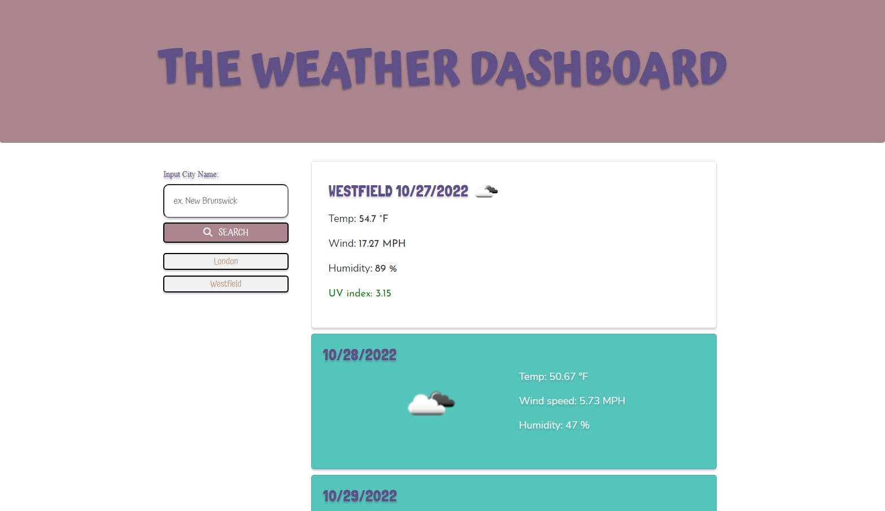
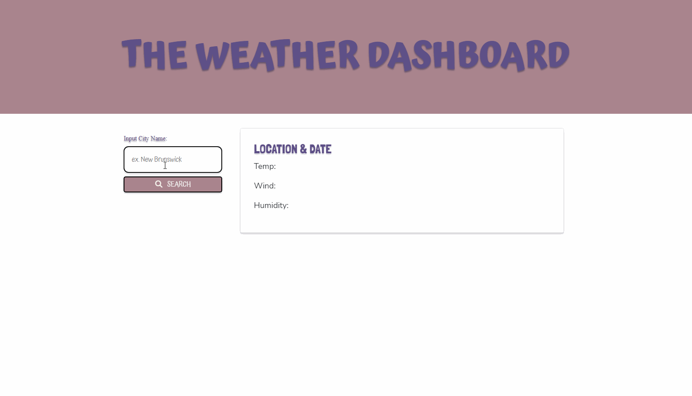
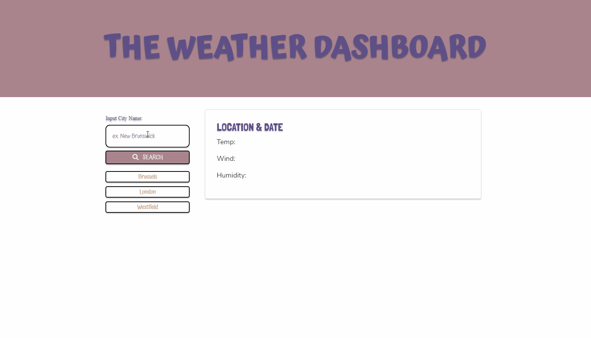

# Weather-Dashboard-API

## Description
This weather application utilizes a server-side API to gather and display weather data via a city name search. This application serves the user so they may discover what the current weather conditions are in their location or any city in the world and also the future conditions. 

## Usage

To use this application, visit this [♡ page ♡](https://cmariego97.github.io/Weather-Dashboard-API/)

Featured is a mock-up of the weather dashboard application:

Type in a name of a city to search for in the search input to retrieve the weather forecast.
The weather for the day as well as the next 5 days will be generated.

A list of previous city searches will be curated under the search form. Clicking on those searches will regenerate the weather data for that city again.

## Credits

- Open Weather API: https://openweathermap.org/api
- API key provided by a tutor for the UV index data

- - -

## License

This application is covered under the MIT license.
To view a description of this license type, refer to the repository or click [♡ here ♡](https://opensource.org/licenses/MIT).

- - -

## Badges

- - -
## About the Author

My name is Claire and I am a student learning Web Development.